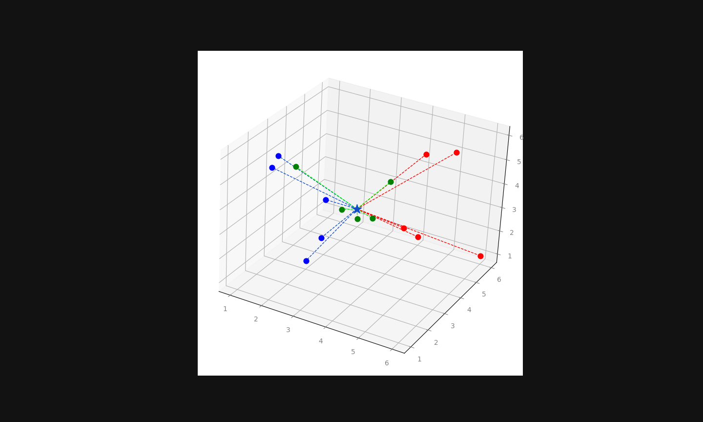

# 🐍 Coding Playground

Welcome to my coding playground! This repository is a collection of algorithms, data structures, and machine learning experiments that I work on to sharpen my skills in **Python** and **Data Science**.

## 📂 Structure
- **Algorithms:** Sorting, searching, and logic problems.
- **LeetCode:** Solutions to competitive programming challenges.
- **ML-Experiments:** Testing concepts in Machine Learning & AI.
- **Scripts:** Useful Python automation scripts.

## 🖼️ Project Snapshots

Below are snapshots from some of the projects and experiments in this repository, ranging from algorithm implementations to machine learning prototypes.

  

---
*Maintained by Simon Carlén*